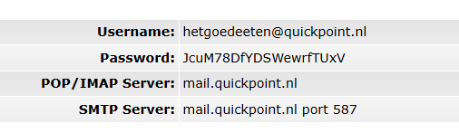

# Het Goede Eten

## Features

- User authentication and management
- Role-based access control (admin, chef) using Spatie Laravel Permission
- Article and order management
- Admin dashboard

## Requirements

- PHP 8.1+
- Composer
- Node.js & npm

## Installation

1. Clone the repository: ``git clone https://github.com/jorian2005/HetGoedeEten.git``
2. Copy `.env.example` to `.env` and configure your environment variables.
3. Generate application key: ```php artisan key:generate```
   - This will set the `APP_KEY` in your `.env` file.
4. Run migrations and seeders: ```php artisan migrate:fresh --seed```
   - This will create the necessary database tables and seed the database with initial data.
5. Build frontend assets: ```npm install && npm run dev```
   - Ensure you have Node.js and npm installed.
   - This will compile the frontend assets using Laravel Mix.
6. Start the development server: ```php artisan serve```
   - This will start the Laravel development server on `http://127.0.0.1:8000`.

## Usage
- Access the application at `http://127.0.0.1:8000`
- Default roles and permissions are seeded via `CreateAdminUserRoles` seeder.

## License

This project is licensed under the MIT License.


## Mail for Testing
https://quickpoint.nl/webmail/

